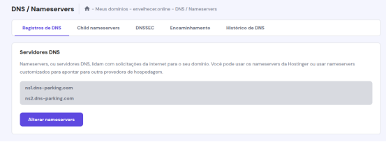
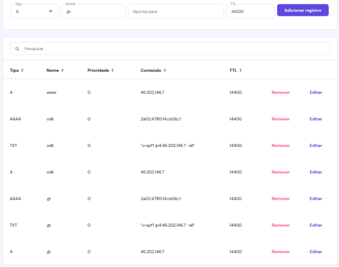
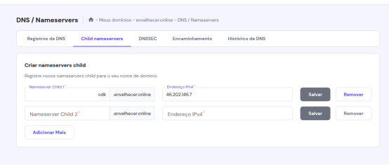

# Instalação do ODK Central

Tutorial de Instalação do ODK Central 

Baseado em: 

- https://docs.getodk.org/central-install

- https://docs.getodk.org/central-install-digital-ocean/#central-install-digital-ocean

Para este tutorial vamos supor uma VPS configurada com UBUNTU 24.04 LTS na Hostinger (hostinger.com) e um dominio `envelhecer.online` com um subdominio `odk.envelhecer.online` que aponta para a VPS.

## Passo 0 - Configurações DNS do dominio e subdominio 

1. Configure "DNS / Nameservers"
a) Registros de DNS (na imagem abaixo substitua IPv4 e IPv6 pelos respectivos IPs da sua VM)

Isso vai linkar o seu dominio ao seu ODK Central inclusive habilitando o envio de email.

b) (Opcional) Child nameservers

Isso vai criar o seu subdominio e apontar para a sua VPS.

## Passo 1 - Configuração da VPS

> Use permissão de root.

1. Acesse a maquina via ssh ou outro cliente de acesso remoto;
2. suba o script `install_odk.sh`;
3. dê permissão de execução  com o comando `chmod +x install_odk.sh`.
4. suba o script `create_useradmin_odk.sh`;
5. dê permissão de execução  com o comando `chmod +x create_useradmin_odk.sh`.

## Passo 2 - Instalação
a) Execute o script com `sudo ./install_odk.sh` ou `sudo bash install_odk.sh` e siga as intruções. ([Detalhes](SCRIPT.md))

b) acesse `/opt/central/` e execute `docker compose up --build -d`

c) (Opcional) acompanhe os logs: `docker compose logs -f`

## Passo 3 - Criação do usuário Admin

> Verifique se o script `odk_create_user.sh` foi copiado para `/opt/central/`.

a) Caso necessário, copie o script `odk_create_user.sh` para `/opt/central/`. Use o comando `cp ~/odk/odk_create_user.sh /opt/central/`

b) Execute o script com `./odk_create_user.sh` ou `sudo bash odk_create_user.sh` e siga as intruções.

c) Acesse o endereço criado para seu ODK Central `odk.envelhecer.online` e faça login com o usuário e senhas criados.

Bom trabalho e boa jornada!!!

 

Configurações complementares no link: https://docs.getodk.org/central-install

